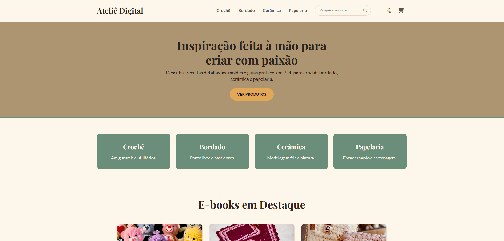
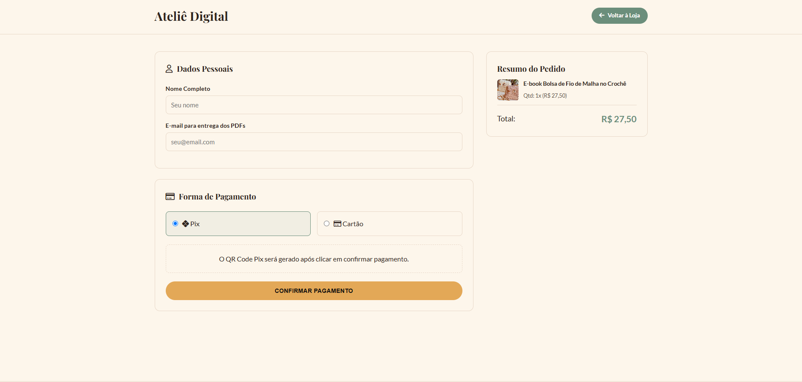

# Ateliê Digital

> Plataforma e-commerce responsiva para venda de e-books e guias práticos em PDF sobre artesanato (crochê, bordado, cerâmica e papelaria).

## Demonstração

- **Site:** `https://atelie-digital.vercel.app`

| Home                           | Checkout                               |
| ------------------------------ | -------------------------------------- |
|  |  |

## Sobre o Projeto

O **Ateliê Digital** foi desenvolvido com o objetivo de oferecer uma experiência de compra fluida, aconchegante e intuitiva para artesãs e entusiastas de trabalhos manuais. A aplicação conta com catálogo interativo, busca dinâmica por palavras-chave, filtragem por categorias, sistema de carrinho de compras em tempo real e suporte a tema claro/escuro.

---

## Funcionalidades

- **Tema Claro e Escuro (Dark Mode):** Alternância simples de tema com salvamento da preferência no `localStorage`.
- **Busca em Tempo Real:** Filtro instantâneo de e-books por título, descrição ou categoria.
- **Filtro por Categorias:** Navegação rápida entre _Crochê_, _Bordado_, _Cerâmica_ e _Papelaria_.
- **Carrinho de Compras Flutuante (Drawer):**
  - Adição e remoção de itens.
  - Ajuste de quantidade dinâmico.
  - Cálculo automático do valor total.
- **Layout Totalmente Responsivo:** Design otimizado para celulares, tablets e desktops.
- **Fluxo de Checkout:** Tela de finalização de pedido simulando opções de pagamento (PIX, Cartão).

---

## Tecnologias Utilizadas

O projeto foi construído utilizando tecnologias fundamentais da web (vanilla), sem dependência de frameworks externos:

- **HTML5:** Estruturação semântica e acessível.
- **CSS3:**
  - Variáveis CSS (`:root`) para gerenciamento de temas.
  - CSS Grid e Flexbox para layouts e alinhamentos.
  - Media Queries para responsividade.
- **JavaScript (ES6+):** Manipulação dinâmica do DOM, gerenciamento de estado do carrinho e integração com `localStorage`.
- **Font Awesome 6:** Ícones vetoriais.
- **Google Fonts:** Tipografia (_Playfair Display_, _Lato_ e _Nunito_)

---

## Estrutura de Pastas

```text
atelie-digital/
├── css/
│   ├── style.css          # Estilos globais, temas e layout base
│   └── responsive.css     # Regras de mídia para dispositivos móveis
├── js/
│   ├── products.js        # Base de dados dos e-books (JSON/Array)
│   ├── main.js            # Lógica da vitrine, busca, filtro e tema
│   └── cart.js            # Gerenciamento do carrinho de compras
├── index.html             # Página inicial (vitrine e carrinho)
├── checkout.html          # Página de finalização de compra
└── README.md              # Documentação do projeto
```

## Como executar

Não é preciso instalar dependências.

1. Clone o repositório:

   ```bash
   git clone https://github.com/seu-usuario/nome-do-repositorio.git
   ```

2. Entre na pasta do projeto:
   ```bash
   cd nome-do-repositorio
   ```

## Possíveis melhorias

- Integração com gateways de pagamento reais (Mercado Pago, Pagar.me, Stripe)
- Sistema de avaliações e comentários nas páginas dos e-books
- Página de detalhes de cada e-book
- Área de login e histórico de downloads para artesãs cadastradas

## Autor

**Desenvolvido por Danielle Braga 🌸**

- GitHub: [@daniebraga](https://github.com/daniebraga)
- LinkedIn: [Danielle Braga](https://www.linkedin.com/in/daniellebbraga/)

## Licença

Este projeto foi desenvolvido para fins de estudo.
